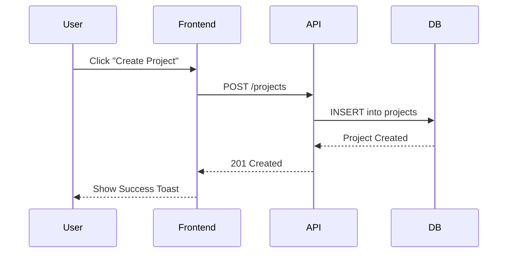

# APP_FLOW.md — High-Level User Journeys & Screen Flows

> **TEMPLATE**: The user flows and diagrams below are illustrative examples only. Replace with actual application flows before use.

**Purpose**: This document captures the primary user flows and interactions within the application to ensure a consistent and intuitive user experience.

## Main Flows

**Purpose**: Document the most common paths users take to achieve their goals.

**Example: User Onboarding**
1. User lands on the landing page and clicks "Get Started".
2. User is redirected to the registration form.
3. User enters their email and chooses a password.
4. User receives a verification email and clicks the link.
5. User completes their profile and is redirected to the dashboard.

**Example: Creating a New Project**
1. User clicks the "New Project" button on the dashboard.
2. A modal appears asking for the project name and description.
3. User enters the details and clicks "Create".
4. The system initializes the project and redirects the user to the project's settings page.

## Edge Cases & Errors

**Purpose**: Detail how the application handles unusual or error conditions.

**Example: Invalid Credentials**
- User enters an incorrect password during login.
- The system displays a clear error message: "Invalid email or password. Please try again."
- The password field is cleared, and the focus is returned to the email field.

**Example: Network Interruption**
- A network error occurs while the user is saving a project.
- The system displays a non-intrusive toast notification: "Unable to save project. Retrying..."
- The system automatically attempts to resave the data when the connection is restored.

## Diagrams

**Purpose**: Use simple text-based diagrams (ASCII or Mermaid) to visualize complex flows.

**Example: ASCII Flow Chart**
```text
[Landing Page] -- "Get Started" --> [Registration Form]
      |                                    |
      |                               [Email Verification]
      |                                    |
      V                                    V
[Dashboard] <------- "Verify" ------- [Welcome Page]
```

**Example: Mermaid Sequence Diagram** (If supported by your renderer)


