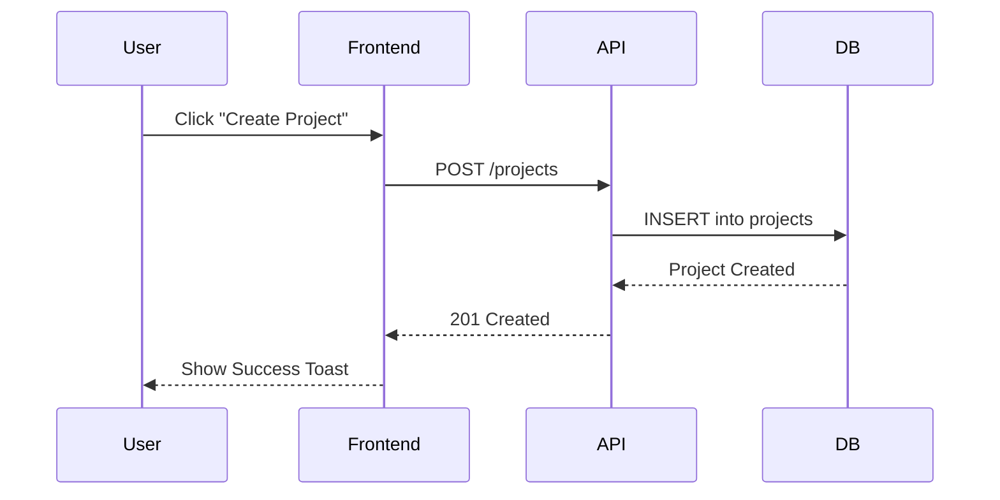

# PRD.md — Product Requirements Document

> **STATUS**: TEMPLATE
> **OWNER**: Human (final authority) / AI (maintenance)
> **LAST REVIEWED**: Unknown

**Purpose**: This document serves as the single source of truth for the product's vision, goals, and requirements. It should be used to align all stakeholders and guide the technical implementation.

## Overview

**Purpose**: A high-level summary of the product's core value proposition and target audience.

**Example (fictional, delete before use)**:
A secure, real-time collaboration platform for distributed engineering teams that integrates with existing version control systems and provides automated project health insights.

## Goals & Success Metrics

**Purpose**: Define measurable outcomes that determine the product's success.

**Example (fictional, delete before use)**:
- **Goal**: Achieve sub-200ms API response time for all core endpoints.
- **KPI**: 95th percentile latency remains below 200ms under 100 concurrent users.
- **Goal**: Ensure high accessibility compliance.
- **KPI**: Zero critical violations in WCAG 2.1 AA audits.

## User Personas

**Purpose**: Describe the primary users and their specific needs or pain points.

**Example (fictional, delete before use)**:
1. **Senior Developer**: Needs automated tools to reduce manual code review time and ensure consistency across the team.
2. **Project Manager**: Requires clear visibility into project progress and potential blockers without needing to read code.

## Features & Requirements

### Must-Have
**Purpose**: Non-negotiable features required for a minimum viable product (MVP).

**Example (fictional, delete before use)**:
- User authentication and authorization.
- Real-time message broadcasting via WebSockets.

### Should-Have
**Purpose**: Important features that add significant value but are not critical for the initial launch.

**Example (fictional, delete before use)**:
- Automated daily activity summaries.
- Search functionality across historical messages.

### Could-Have
**Purpose**: "Nice to have" features that can be implemented if time and resources permit.

**Example (fictional, delete before use)**:
- Custom theme support for the user interface.
- Integration with third-party calendar services.

### Won't-Have (for now)
**Purpose**: Features explicitly excluded from the current scope to prevent scope creep.

**Example (fictional, delete before use)**:
- Native mobile applications (initial focus is web-only).
- Support for on-premise deployments.

## Non-Functional Requirements

**Purpose**: Constraints on the system's operation, such as performance, security, and accessibility.

**Example (fictional, delete before use)**:
- **Performance**: The system should support up to 1,000 concurrent WebSocket connections.
- **Security**: All data at rest must be encrypted using AES-256.
- **Accessibility**: Support for screen readers and keyboard-only navigation.

## Assumptions & Risks

**Purpose**: Explicitly state any assumptions made during planning and identify potential risks.

**Example (fictional, delete before use)**:
- **Assumption**: Users have a stable internet connection for real-time features.
- **Risk**: Potential latency issues if the chosen WebSocket provider experiences downtime.

## User Journeys & Edge Cases

**Purpose**: Document the primary user flows and how the system behaves on errors or unusual conditions.

**Example (fictional, delete before use): User Onboarding**
1. User lands on the landing page and clicks "Get Started".
2. User is redirected to the registration form.
3. User enters their email and chooses a password.
4. User receives a verification email and clicks the link.
5. User completes their profile and is redirected to the dashboard.

**Example (fictional, delete before use): Creating a New Project**
1. User clicks the "New Project" button on the dashboard.
2. A modal appears asking for the project name and description.
3. User enters the details and clicks "Create".
4. The system initializes the project and redirects the user to the project's settings page.

**Example (fictional, delete before use): Invalid Credentials**
- User enters an incorrect password during login.
- The system displays a clear error message: "Invalid email or password. Please try again."
- The password field is cleared, and the focus is returned to the email field.

**Example (fictional, delete before use): Network Interruption**
- A network error occurs while the user is saving a project.
- The system displays a non-intrusive toast notification: "Unable to save project. Retrying..."
- The system automatically attempts to resave the data when the connection is restored.

## Flow Diagrams (optional)

**Purpose**: Use simple text-based diagrams (ASCII or Mermaid) to visualize complex flows.

**Example (fictional, delete before use): ASCII Flow Chart**
```text
[Landing Page] -- "Get Started" --> [Registration Form]
      |                                    |
      |                               [Email Verification]
      |                                    |
      V                                    V
[Dashboard] <------- "Verify" ------- [Welcome Page]
```

**Example (fictional, delete before use): Mermaid Sequence Diagram** (If supported by your renderer)


## Implementation Plan (Consolidated)

**Purpose**: Track phased execution, key decisions, and verification steps in one place.

### Current Milestone

**Purpose**: Define the immediate focus and deadline.

**Example (fictional, delete before use)**:
MVP Launch - February 28, 2026

### Phases

**Purpose**: Break the project into logical, sequential phases.

**Example (fictional, delete before use)**:
1. Foundation (Infra, Auth, DB) - *Medium Effort*
2. Core Features (Messaging, Project Management) - *Large Effort*
3. Polishing & Optimization (UI/UX, Performance) - *Small Effort*

### Open Decisions

**Purpose**: Track pending architectural or product decisions that impact the implementation.

> **EXAMPLE ASSUMPTIONS**: The “Chosen” values below (e.g., PostgreSQL, Tailwind) are illustrative examples showing how to record decisions.
> Replace them with your project’s actual choices (or mark as TBD) and keep them consistent with `TECH_STACK.md`.

| Decision | Options | Chosen | Reason |
|----------|---------|--------|--------|
| Database Selection | PostgreSQL vs. MongoDB | PostgreSQL | Strong relational integrity and robust support for JSONB. |
| Styling Strategy | Tailwind vs. CSS Modules | Tailwind | Faster development cycle and consistent utility patterns. |

### Task Breakdown

**Purpose**: Detailed, atomic checklist of tasks for each phase.

#### Phase 1: Foundation
- [ ] Initialize project repository and CI/CD pipelines.
- [ ] Implement user authentication (Sign-up, Login, Logout).
- [ ] Set up database schema and initial migrations.

**Verification**:
- [ ] All unit tests pass (`npm test`).
- [ ] Authentication flow verified via manual UI check.
- [ ] Database connection established and migrations applied successfully.

### Dependencies & Blockers

**Purpose**: Identify external factors or internal tasks that prevent progress.

**Example (fictional, delete before use)**:
- Deployment blocked by final approval of infrastructure budget. (Status: Pending)
- Integration with third-party API requires API key from the user. (Status: Blocked)

### Risks & Mitigations

**Purpose**: Anticipate potential issues and define strategies to handle them.

> **EXAMPLE ASSUMPTIONS**: The examples below assume WebSocket-based real-time features and Redis for message brokering.
> Replace with risks/mitigations that match your architecture.

**Example (fictional, delete before use)**:
- **Risk**: Potential performance bottlenecks with high concurrent WebSocket connections.
- **Mitigation**: Implement horizontal scaling for WebSocket servers and use a Redis-backed message broker.

### Version Control Workflow

**Guidance**:
- **Atomic Commits**: Commit each task separately to maintain a clean history.
- **Verification First**: Do not commit code that fails local tests or linting.
- **PR Summary**: Include a "Verification" section in PR descriptions to show evidence of testing.

## Task Board (Consolidated)

**Purpose**: Single checklist of atomic tasks grouped by priority or session.

### High Priority
- [ ] <task>

### This Session: <YYYY-MM-DD>

**Focus**: <focus>

- [ ] <task-id> — <task>

### Later (Backlog)
- [ ] <task>

## Out of Scope

**Purpose**: Clearly define what the product will NOT do to maintain focus.

**Example (fictional, delete before use)**:
- Direct billing or payment processing (handled by a separate service).
- Comprehensive project management features (focus is on collaboration).
